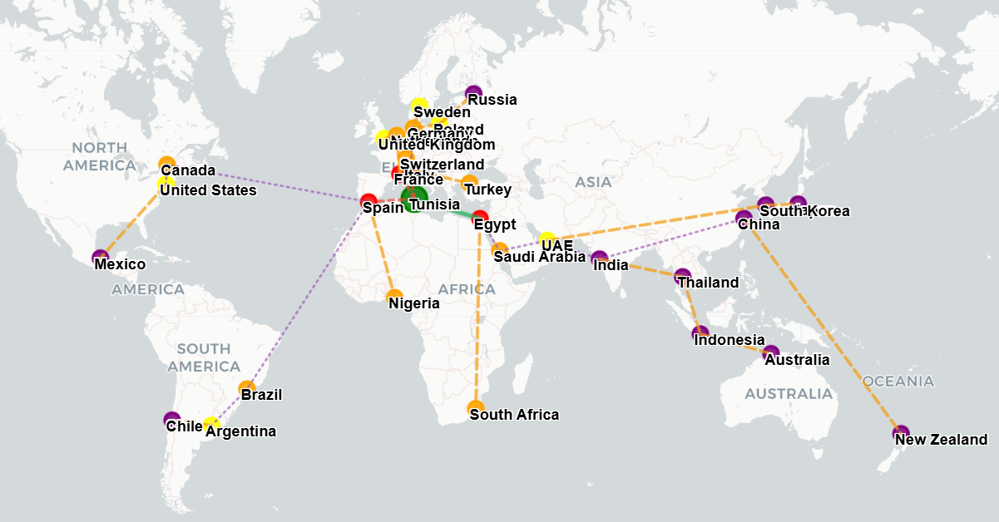
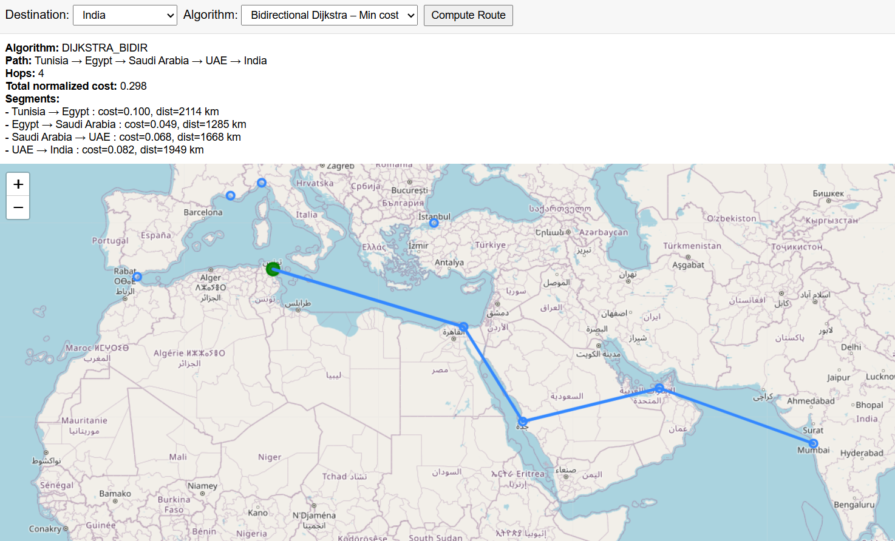

# 🌍 Tunisia Olive Oil Export Route Simulator

An interactive Python–Flask web application that models global shipping routes and computes **optimal export paths for Tunisian olive oil** using advanced graph search algorithms.

The project builds a realistic logistics graph with:

- Port & capital coordinates
- Maritime & land multipliers
- Suez/Panama canal penalties
- Hub–based restricted routing
- Normalized shipping cost model

Users can visualize country nodes on an interactive world map and compute optimal routes from **Tunisia** to any destination.

---

## 🚀 Features

- **Realistic logistics graph** (ports, hubs, neighbors, distances, penalties)
- **Multiple pathfinding algorithms**:
  - **Dijkstra (min cost)**
  - **Bidirectional Dijkstra (min cost, faster)**
  - **A\*** (min cost with geographic heuristic)
- Interactive world map visualization (Leaflet.js)
- REST API for route computation
- Clear cost breakdown & route segments

---



---

## 🧠 Algorithms

### ✓ Dijkstra (Min Cost)

Computes the cheapest shipping route using normalized logistics cost.

### ✓ Bidirectional Dijkstra

Runs Dijkstra simultaneously **from Tunisia** and **from the destination**, meeting in the middle to accelerate search.

### ✓ A\*

Uses a geographic (Haversine) heuristic to guide the search and reduce explored nodes:  
`f(n) = g(n) + h(n)`.

---

## Run the App

### Install dependencies

```bash
pip install flask
python app.py
# Open in browser:
# http://127.0.0.1:5000
```

### Output

- Optimal route
- Cost of each shipping segment
- Total normalized logistics cost
- Number of hops
- Path visualized on an interactive world map



🌐 **Live Demo:**  
https://olive-oil-export-routes.onrender.com/
